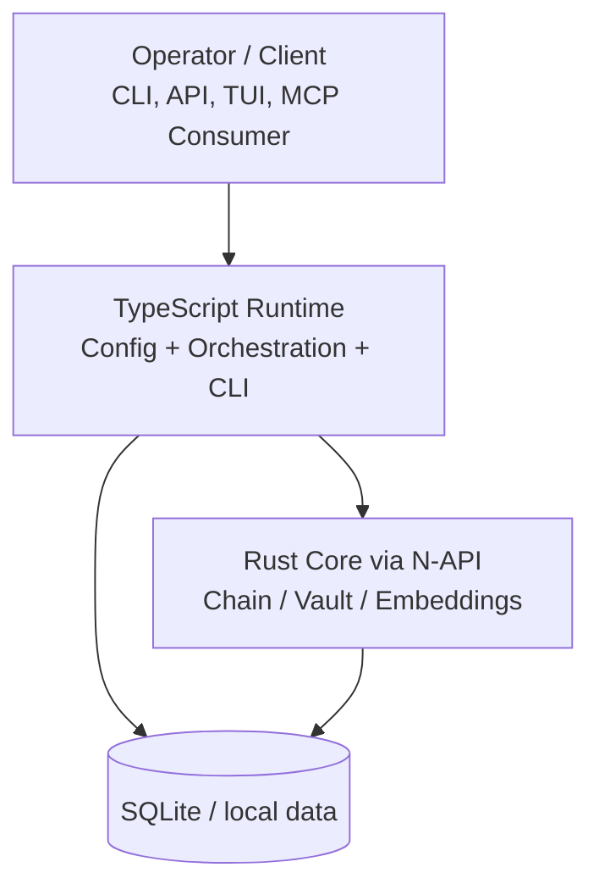
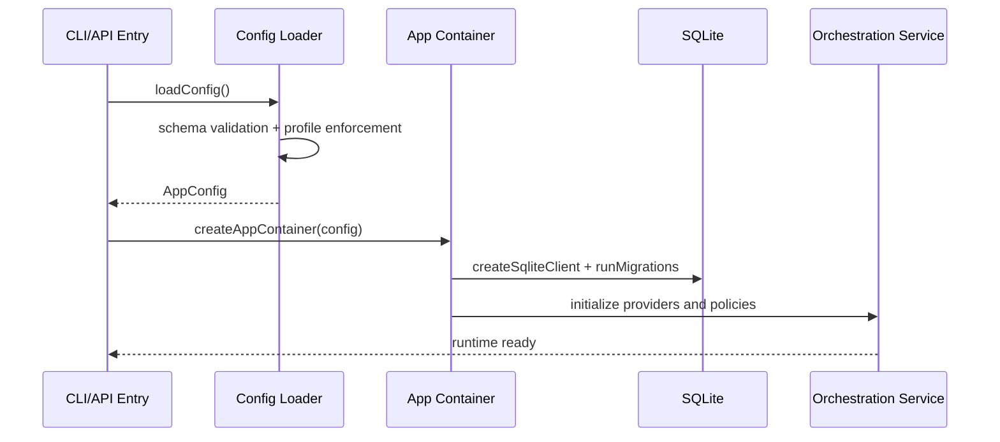
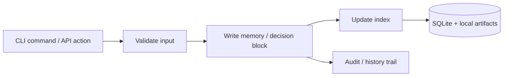

# Memphis v5 Architecture


This document describes the technical architecture of Memphis v5 for operators and contributors.

---

## 1) High-level overview

Memphis v5 is a **local-first cognitive memory layer** with:
- TypeScript orchestration/runtime
- Rust core bridge for performance/security-critical paths
- SQLite-backed persistence
- Optional provider routing and MCP transport

### System context



---

## 2) Component model

## 2.1 Runtime orchestration (TypeScript)

Main responsibilities:
- bootstrap and config validation
- provider routing and failover
- CLI command surface
- HTTP server and operational health

Key files:
- `src/app/bootstrap.ts`
- `src/app/container.ts`
- `src/infra/config/schema.ts`
- `src/infra/cli/index.ts`

## 2.2 Chain subsystem

Responsibilities:
- append/validate/query integrity-linked memory records
- rebuild searchable indexes
- import chain history from JSON

Activation mode:
- TS fallback when `RUST_CHAIN_ENABLED=false`
- Rust N-API bridge when `RUST_CHAIN_ENABLED=true`

## 2.3 Storage subsystem

- SQLite primary runtime storage (`DATABASE_URL`)
- Local files for vault entries and operational artifacts
- Journal and memory artifacts maintained locally

## 2.4 Sync and multi-agent subsystem

- chain sync (`sync push`/`sync pull`)
- trade offers between agents (`trade offer`/`trade accept`)
- agent discovery and relationship/trust analysis commands

## 2.5 Security subsystem

Cryptographic primitives used in architecture:
- Argon2id (derivation hardening)
- AES-256-GCM (authenticated encryption)
- Ed25519 (signing/verification workflows)
- SHA-256 (integrity/chaining)

---

## 3) Data flow diagrams

## 3.1 Boot flow



## 3.2 Memory/chain write path



## 3.3 Retrieval path (semantic)


---

## 4) Technical decisions

1. **Local-first persistence**
   - Reduces external dependency risk and improves sovereignty.

2. **TypeScript + Rust split**
   - TS for orchestration ergonomics and CLI velocity.
   - Rust for secure/performance-sensitive paths.

3. **Strict configuration validation**
   - Runtime fails fast for invalid provider and production settings.

4. **Provider fallback model**
   - Local fallback path remains available for resilience.

5. **Operational command-first workflow**
   - Health checks, smoke scripts, and release gates are first-class.

---

## 5) Security model

## Trust boundaries

- External providers are optional and isolated by explicit credentials.
- Local runtime data is primary source of truth.
- Production mode requires explicit API token and provider safety checks.

## Security controls

- Environment-based secret injection (`.env`, not source code)
- Production startup validation (`MEMPHIS_API_TOKEN` required)
- Gateway exec restriction/allowlist controls
- Cryptographic integrity and signing primitives

## Security assumptions

- Operator controls host and file permissions
- Secrets are rotated and never committed
- Production hosts apply OS-level hardening

Related docs:
- [CONFIGURATION.md](./CONFIGURATION.md)
- [TROUBLESHOOTING.md](./TROUBLESHOOTING.md)
- [../SECURITY.md](../SECURITY.md)

---

## 6) Operational architecture checks

Run these commands after major upgrades:

```bash
npm run -s cli -- doctor --json
npm run -s cli -- health --json
npm test
npm run build
```

For install-level checks, see [INSTALLATION.md](./INSTALLATION.md).
