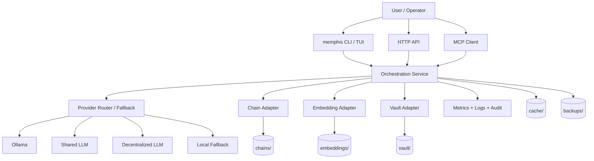
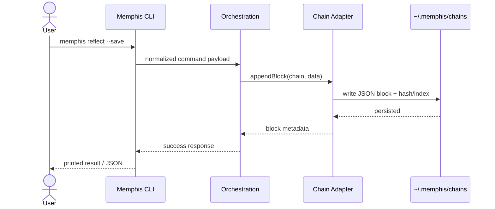
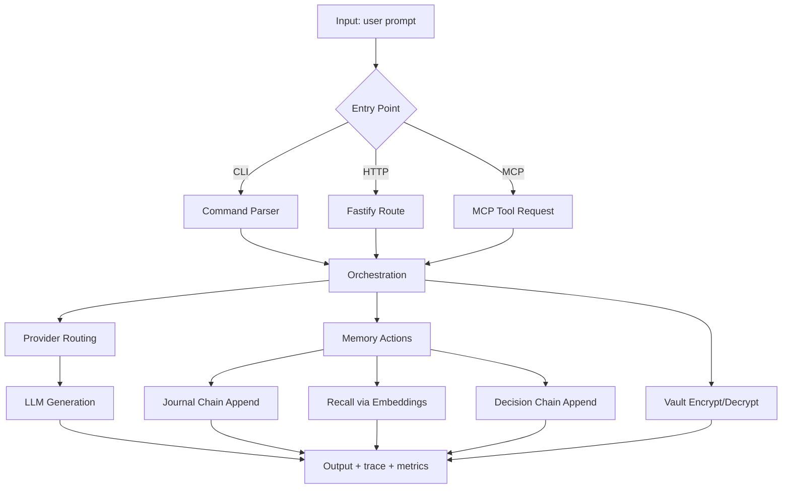

# Memphis v5 Architecture Guide

This document describes Memphis v5 runtime architecture, data flow, storage layers, multi-agent sync, provider routing, and security model.

## 1) System Components



Core layers:
- **Entry points**: CLI, HTTP API, MCP transport
- **Orchestration**: provider selection, retries, session/event persistence
- **Storage adapters**: chain, vault, embedding bridge, cache
- **Ops/security**: metrics, health checks, rate limiting, audit logs

---

## 2) Data Flow (User → CLI → Chain → Storage)



Equivalent HTTP flow (`/api/journal`, `/api/decide`) follows the same append path.

---

## 3) Storage Layers

Base path resolution is from `MEMPHIS_DATA_DIR` (fallback `~/.memphis`).

- `chains/` → chain blocks (journal, decision, etc.)
- `vault/` → encrypted vault artifacts
- `embeddings/` → embedding/index artifacts (Rust side)
- `cache/` → runtime cache state
- `backups/` → tarball backups + checksums + manifest
- `logs/` → operational logs

### Layer responsibilities
- **Chains**: durable append-only memory and decision history
- **Vault**: secret encryption/decryption and identity binding
- **Embeddings**: semantic recall/search index
- **Cache**: latency optimization (file cache + query cache + embed search cache)

---

## 4) Multi-agent Sync Architecture

Sync supports peer discovery/registry with push/pull, diff detection, and conflict resolution.

```mermaid
flowchart LR
    A[Agent A did:memphis:a] <--> REG[(Sync Registry)]
    B[Agent B did:memphis:b] <--> REG
    C[Agent C did:memphis:c] <--> REG

    A --> P1[sync.push(chain, blocks)] --> B
    A --> P2[sync.push(chain, blocks)] --> C

    B --> Q1[sync.pull(chain)] --> A
    Q1 --> D[detectChainDiff]
    D --> R[resolveChainConflicts]
    R --> W[write merged chain]
```

Key modules:
- `src/sync/sync-manager.ts`
- `src/sync/protocol.ts`
- `src/sync/chain-diff.ts`
- `src/sync/conflict-resolver.ts`
- `src/sync/agent-registry.ts`

Operational model:
- `push` sends full chain blocks to known peers
- `pull` fetches remote chain and merges
- peer status is tracked (online/offline)

---

## 5) Provider Routing Logic

Memphis has two routing surfaces:

1. **Generation orchestration routing** (`provider=auto`, strategy-driven retries/fallback)
2. **Dynamic capability routing** (`DynamicRouter`) for choosing provider/model by requirements.

Routing inputs:
- task type (`chat`, `code`, `analysis`, `creative`)
- priority (`latency`, `cost`, `quality`)
- requirements (`minContextWindow`, vision, function-calling)

Decision output:
- selected provider
- selected model
- reason string

Fallback principle:
- If preferred provider fails, orchestrator can move to fallback providers.
- Traces are returned in generation response (`trace.attempts`).

---

## 6) Security Model

### 6.1 Transport/API Controls
- Bearer token auth (`MEMPHIS_API_TOKEN`)
- Route-level auth policy
- Global and sensitive rate limits
- CORS + security headers (`X-Frame-Options`, `nosniff`, etc.)
- Request IDs (`x-request-id`) for correlation

### 6.2 Crypto & Identity
- Key derivation: **Argon2id**
- Encryption: **AES-256-GCM**
- DID identity: **Ed25519-derived `did:memphis:*`**
- Recovery/2FA-like factor: passphrase + Q&A derivation path

### 6.3 Auditing
- Security events written to JSONL (`data/security-audit.jsonl` by default)
- Logged events include action, status, route, IP, details, timestamp

### 6.4 Exec surface hardening (Gateway)
- Dedicated auth enforcement for `/exec`
- Explicit command policy validation
- rate limit + audit log on attempts/errors

---

## 7) Data Flow Visualization (End-to-End)



---

## 8) Architectural Notes

- Memphis is local-first by default, with optional external providers.
- Rust bridge enables stronger crypto/storage primitives while TypeScript owns orchestration and interfaces.
- Operational reliability is built around health checks, backup tooling, rate limiting, and explicit error contracts.
